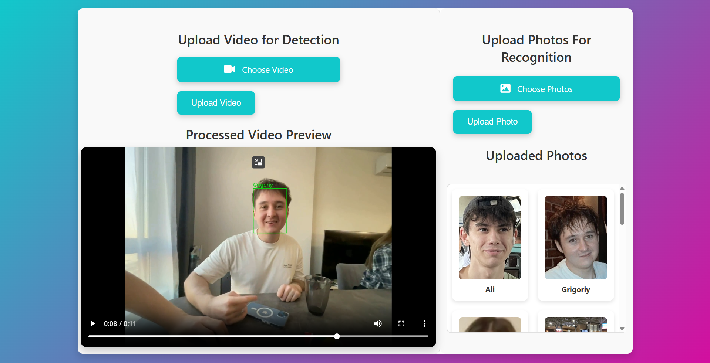

# Проект детекции с использованием FaceNet

Проект представляет собой сайт для детекции и распознавания лиц на видео. Распознавание людей реализовано с использованием FaceNet, что позволяет добиться высокой точности, загружая всего одно фото интересующего человека.

## Содержание

1. [Структура проекта](#структура-проекта)  
2. [Зависимости](#зависимости)  
3. [Настройка и установка](#настройка-и-установка)  
4. [Описание сайта](#описание-сайта)  
5. [Функционал](#функционал)  
6. [Пример работы](#пример-работы)  
7. [Визуализация работы](#визуализация-работы)  
8. [Лицензия](#лицензия)

---

## Структура проекта

```
/face_recognition_site
|-- examples/
|   |-- example.png  # Скриншот работы сайта
|
|-- templates/
|   |-- index.html
|
|-- app.py
|
|-- create_embeddings.py
|
|-- detection.py
```

---

## Зависимости

Перед запуском проекта установите следующие зависимости:

- Python 3.8+
- PyTorch
- OpenCV
- NumPy
- Facenet PyTorch
- Flask
- MoviePy
- Pandas
- Pillow
- Scikit-learn
- Werkzeug

Установите необходимые библиотеки с помощью команды:

```bash
pip install -r requirements.txt
```

---

## Настройка и установка

1. Клонируйте или скачайте репозиторий [Sort](https://github.com/abewley/sort).
2. Клонируйте или скачайте данный репозиторий.
3. Установите зависимости:
   ```bash
   pip install -r requirements.txt
   ```
4. Укажите путь к [Sort](https://github.com/abewley/sort) в переменной `path_to_sort`.

---

## Описание сайта

Сайт позволяет выполнять детекцию и распознавание лиц на видео. Пользователь может загружать фотографии интересующих людей. Если на видео обнаруживается лицо, соответствующее загруженному изображению, оно подписывается соответствующим именем.

---

## Функционал

- **Детекция лиц**: Автоматическое обнаружение всех лиц в кадре.
- **Загрузка фотографий для распознавания**: Пользователи могут загрузить фотографии людей, которых они хотят идентифицировать.
- **Сохранение неизвестных лиц**: Лица, не распознанные среди загруженных фотографий, сохраняются для дальнейшей обработки.
- **Идентификация лиц**: Распознанные лица подписываются именами на видео.
- **Подпись неизвестных лиц**: Лица, которые уже встречались ранее, подписываются с использованием уникального индекса.

---

## Пример работы

1. Пользователь загружает фотографии людей. Имя файла с изображением должно совпадать с именем человека.
2. Сайт обрабатывает изображение с использованием FaceNet и создает файл с эмбеддингами. Загруженные фотографии отображаются на сайте.
3. Пользователь загружает видео.
4. На сайте отображается обработанное видео с детектированными лицами. Лица подписаны соответствующими именами.

---

## Визуализация работы



<video controls width="1920">
  <source src="examples/example_video.mp4" type="video/mp4">
  Your browser does not support the video tag.
</video>

---

## Лицензия

Этот проект является открытым и распространяется под лицензией MIT.
